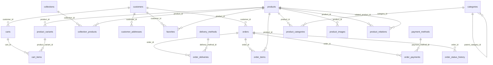

# База данных

Документация автоматически построена по SQL-миграциям PostgreSQL.

- Таблиц: **20**
- Полей: **175**
- Внешних ключей: **23**
- Индексов: **35**

## ER-диаграмма

## Индексы

| Индекс | Таблица | Поля/выражение | UNIQUE | Метод |
|---|---|---|---:|---|
| product_variants_product_id_idx | product_variants | product_id | нет | btree |
| product_images_product_id_sort_order_idx | product_images | product_id, sort_order | нет | btree |
| categories_parent_category_id_idx | categories | parent_category_id | нет | btree |
| categories_visible_sort_order_idx | categories | is_visible, sort_order | нет | btree |
| product_categories_category_id_idx | product_categories | category_id | нет | btree |
| product_categories_category_sort_order_idx | product_categories | category_id, sort_order | нет | btree |
| collections_sort_order_idx | collections | sort_order | нет | btree |
| collection_products_product_id_idx | collection_products | product_id | нет | btree |
| collection_products_collection_sort_order_idx | collection_products | collection_id, sort_order | нет | btree |
| products_active_idx | products | is_active | нет | btree |
| products_tea_type_idx | products | tea_type | нет | btree |
| products_country_idx | products | country | нет | btree |
| products_region_idx | products | region | нет | btree |
| products_manufacturer_idx | products | manufacturer | нет | btree |
| customer_addresses_customer_id_idx | customer_addresses | customer_id | нет | btree |
| carts_customer_id_idx | carts | customer_id | нет | btree |
| cart_items_cart_id_idx | cart_items | cart_id | нет | btree |
| cart_items_product_variant_id_idx | cart_items | product_variant_id | нет | btree |
| orders_customer_id_idx | orders | customer_id | нет | btree |
| orders_status_idx | orders | status | нет | btree |
| orders_ordered_at_idx | orders | ordered_at | нет | btree |
| order_items_order_id_idx | order_items | order_id | нет | btree |
| order_items_product_id_idx | order_items | product_id | нет | btree |
| order_status_history_order_id_idx | order_status_history | order_id | нет | btree |
| order_status_history_new_status_idx | order_status_history | new_status | нет | btree |
| order_status_history_changed_at_idx | order_status_history | changed_at | нет | btree |
| order_deliveries_delivery_method_id_idx | order_deliveries | delivery_method_id | нет | btree |
| order_payments_order_id_idx | order_payments | order_id | нет | btree |
| order_payments_payment_method_id_idx | order_payments | payment_method_id | нет | btree |
| product_variants_catalog_idx | product_variants | product_id, status, is_available, sort_order | нет | btree |
| categories_catalog_idx | categories | is_visible, sort_order, slug | нет | btree |
| collections_catalog_idx | collections | is_active, show_on_home, sort_order | нет | btree |
| collections_dates_idx | collections | starts_at, ends_at | нет | btree |
| product_relations_product_idx | product_relations | product_id, relation_type, sort_order | нет | btree |
| product_relations_related_product_idx | product_relations | related_product_id | нет | btree |

## cart_items

Товары и их количество в корзине.

Источник: `database/migrations/030_carts/tables/002_cart_items.sql`

| Поле | Тип | NULL | Значение по умолчанию | Ключи |
|---|---|---:|---|---|
| id | UUID | нет | gen_random_uuid() | PK |
| cart_id | UUID | нет |  |  |
| product_variant_id | UUID | нет |  |  |
| quantity | INTEGER | нет | 1 |  |
| price_at_addition | NUMERIC(12,2) | нет |  |  |
| created_at | TIMESTAMPTZ | нет | NOW() |  |
| updated_at | TIMESTAMPTZ | нет | NOW() |  |
### Внешние ключи

| Поле | Связанная таблица | Поле назначения |
|---|---|---|
| cart_id | carts | id |
| product_variant_id | product_variants | id |

### Ограничения

- `CONSTRAINT cart_items_cart_fk FOREIGN KEY (cart_id) REFERENCES carts(id) ON DELETE CASCADE`
- `CONSTRAINT cart_items_variant_fk FOREIGN KEY (product_variant_id) REFERENCES product_variants(id) ON DELETE RESTRICT`
- `CONSTRAINT cart_items_cart_variant_unique UNIQUE ( cart_id, product_variant_id )`
- `CONSTRAINT cart_items_quantity_check CHECK (quantity > 0)`
- `CONSTRAINT cart_items_price_check CHECK (price_at_addition >= 0)`

## carts

Корзины авторизованных покупателей и гостей.

Источник: `database/migrations/030_carts/tables/001_carts.sql`

| Поле | Тип | NULL | Значение по умолчанию | Ключи |
|---|---|---:|---|---|
| id | UUID | нет | gen_random_uuid() | PK |
| customer_id | UUID | да |  |  |
| guest_token | UUID | да |  | UNIQUE |
| status | VARCHAR(32) | нет | 'active' |  |
| created_at | TIMESTAMPTZ | нет | NOW() |  |
| updated_at | TIMESTAMPTZ | нет | NOW() |  |
### Внешние ключи

| Поле | Связанная таблица | Поле назначения |
|---|---|---|
| customer_id | customers | id |

### Ограничения

- `CONSTRAINT carts_customer_fk FOREIGN KEY (customer_id) REFERENCES customers(id) ON DELETE RESTRICT`
- `CONSTRAINT carts_guest_token_unique UNIQUE (guest_token)`
- `CONSTRAINT carts_status_check CHECK ( status IN ( 'active', 'converted', 'abandoned', 'expired' ) )`
- `CONSTRAINT carts_owner_check CHECK ( ( customer_id IS NOT NULL AND guest_token IS NULL ) OR ( customer_id IS NULL AND guest_token IS NOT NULL ) )`

## categories

Иерархические категории и подкатегории каталога.

Источник: `database/migrations/010_catalog/tables/004_categories.sql`

| Поле | Тип | NULL | Значение по умолчанию | Ключи |
|---|---|---:|---|---|
| id | UUID | нет | gen_random_uuid() | PK |
| parent_category_id | UUID | да |  |  |
| name | VARCHAR(255) | нет |  |  |
| description | TEXT | да |  |  |
| image_url | TEXT | да |  |  |
| sort_order | INTEGER | нет | 0 |  |
| is_visible | BOOLEAN | нет | TRUE |  |
| created_at | TIMESTAMPTZ | нет | NOW() |  |
| updated_at | TIMESTAMPTZ | нет | NOW() |  |
### Внешние ключи

| Поле | Связанная таблица | Поле назначения |
|---|---|---|
| parent_category_id | categories | id |

### Ограничения

- `CONSTRAINT categories_parent_fk FOREIGN KEY (parent_category_id) REFERENCES categories(id) ON DELETE SET NULL`
- `CONSTRAINT categories_parent_name_uq UNIQUE (parent_category_id, name)`
- `CONSTRAINT categories_not_own_parent_check CHECK ( parent_category_id IS NULL OR parent_category_id <> id )`
- `CONSTRAINT categories_sort_order_check CHECK (sort_order >= 0)`

## collection_products

Связь товаров с подборками каталога.

Источник: `database/migrations/010_catalog/tables/007_collection_products.sql`

| Поле | Тип | NULL | Значение по умолчанию | Ключи |
|---|---|---:|---|---|
| collection_id | UUID | нет |  | PK |
| product_id | UUID | нет |  | PK |
| sort_order | INTEGER | нет | 0 |  |
### Внешние ключи

| Поле | Связанная таблица | Поле назначения |
|---|---|---|
| collection_id | collections | id |
| product_id | products | id |

### Ограничения

- `CONSTRAINT collection_products_pk PRIMARY KEY (collection_id, product_id)`
- `CONSTRAINT collection_products_collection_fk FOREIGN KEY (collection_id) REFERENCES collections(id) ON DELETE CASCADE`
- `CONSTRAINT collection_products_product_fk FOREIGN KEY (product_id) REFERENCES products(id) ON DELETE CASCADE`
- `CONSTRAINT collection_products_sort_order_check CHECK (sort_order >= 0)`

## collections

Подборки товаров каталога.

Источник: `database/migrations/010_catalog/tables/006_collections.sql`

| Поле | Тип | NULL | Значение по умолчанию | Ключи |
|---|---|---:|---|---|
| id | UUID | нет | gen_random_uuid() | PK |
| name | VARCHAR(255) | нет |  |  |
| description | TEXT | да |  |  |
| image_url | TEXT | да |  |  |
| sort_order | INTEGER | нет | 0 |  |
| created_at | TIMESTAMPTZ | нет | NOW() |  |
| updated_at | TIMESTAMPTZ | нет | NOW() |  |
### Ограничения

- `CONSTRAINT collections_sort_order_check CHECK (sort_order >= 0)`

## customer_addresses

Сохранённые адреса доставки покупателей.

Источник: `database/migrations/020_customers/tables/002_customer_addresses.sql`

| Поле | Тип | NULL | Значение по умолчанию | Ключи |
|---|---|---:|---|---|
| id | UUID | нет | gen_random_uuid() | PK |
| customer_id | UUID | нет |  |  |
| address_name | VARCHAR(100) | нет |  |  |
| recipient_name | VARCHAR(255) | нет |  |  |
| phone | VARCHAR(32) | нет |  |  |
| region | VARCHAR(150) | да |  |  |
| city | VARCHAR(150) | нет |  |  |
| street | VARCHAR(255) | нет |  |  |
| house | VARCHAR(50) | нет |  |  |
| apartment | VARCHAR(50) | да |  |  |
| postal_code | VARCHAR(20) | да |  |  |
| comment | TEXT | да |  |  |
| is_default | BOOLEAN | нет | FALSE |  |
| created_at | TIMESTAMPTZ | нет | NOW() |  |
| updated_at | TIMESTAMPTZ | нет | NOW() |  |
### Внешние ключи

| Поле | Связанная таблица | Поле назначения |
|---|---|---|
| customer_id | customers | id |

### Ограничения

- `CONSTRAINT customer_addresses_customer_fk FOREIGN KEY (customer_id) REFERENCES customers(id) ON DELETE CASCADE`

## customers

Профили покупателей Telegram Mini App.

Источник: `database/migrations/020_customers/tables/001_customers.sql`

| Поле | Тип | NULL | Значение по умолчанию | Ключи |
|---|---|---:|---|---|
| id | UUID | нет | gen_random_uuid() | PK |
| phone | VARCHAR(32) | нет |  | UNIQUE |
| name | VARCHAR(255) | да |  |  |
| email | VARCHAR(320) | да |  |  |
| username | VARCHAR(255) | да |  |  |
| birth_date | DATE | да |  |  |
| created_at | TIMESTAMPTZ | нет | NOW() |  |
| updated_at | TIMESTAMPTZ | нет | NOW() |  |
### Ограничения

- `CONSTRAINT customers_phone_uq UNIQUE (phone)`
- `CONSTRAINT customers_birth_date_check CHECK ( birth_date IS NULL OR birth_date <= CURRENT_DATE )`

## delivery_methods

Доступные способы доставки заказов.

Источник: `database/migrations/050_delivery/tables/001_delivery_methods.sql`

| Поле | Тип | NULL | Значение по умолчанию | Ключи |
|---|---|---:|---|---|
| id | UUID | нет | gen_random_uuid() | PK |
| name | VARCHAR(255) | нет |  | UNIQUE |
| base_cost | NUMERIC(12,2) | нет | 0 |  |
| delivery_term | VARCHAR(255) | да |  |  |
| is_active | BOOLEAN | нет | TRUE |  |
| sort_order | INTEGER | нет | 0 |  |
| created_at | TIMESTAMPTZ | нет | NOW() |  |
| updated_at | TIMESTAMPTZ | нет | NOW() |  |
### Ограничения

- `CONSTRAINT delivery_methods_name_unique UNIQUE (name)`
- `CONSTRAINT delivery_methods_base_cost_check CHECK (base_cost >= 0)`
- `CONSTRAINT delivery_methods_sort_order_check CHECK (sort_order >= 0)`

## favorites

Избранные товары покупателей.

Источник: `database/migrations/020_customers/tables/003_favorites.sql`

| Поле | Тип | NULL | Значение по умолчанию | Ключи |
|---|---|---:|---|---|
| customer_id | UUID | нет |  | PK |
| product_id | UUID | нет |  | PK |
| created_at | TIMESTAMPTZ | нет | NOW() |  |
### Внешние ключи

| Поле | Связанная таблица | Поле назначения |
|---|---|---|
| customer_id | customers | id |
| product_id | products | id |

### Ограничения

- `CONSTRAINT favorites_pk PRIMARY KEY ( customer_id, product_id )`
- `CONSTRAINT favorites_customer_fk FOREIGN KEY (customer_id) REFERENCES customers(id) ON DELETE CASCADE`
- `CONSTRAINT favorites_product_fk FOREIGN KEY (product_id) REFERENCES products(id) ON DELETE CASCADE`

## order_deliveries

Снимок параметров доставки конкретного заказа.

Источник: `database/migrations/050_delivery/tables/002_order_deliveries.sql`

| Поле | Тип | NULL | Значение по умолчанию | Ключи |
|---|---|---:|---|---|
| id | UUID | нет | gen_random_uuid() | PK |
| order_id | UUID | нет |  | UNIQUE |
| delivery_method_id | UUID | нет |  |  |
| cost | NUMERIC(12,2) | нет | 0 |  |
| recipient_name | VARCHAR(255) | нет |  |  |
| phone | VARCHAR(32) | нет |  |  |
| full_address | TEXT | нет |  |  |
| comment | TEXT | да |  |  |
| tracking_number | VARCHAR(255) | да |  |  |
| delivery_service | VARCHAR(255) | да |  |  |
| status | VARCHAR(32) | нет | 'pending' |  |
| handed_over_at | TIMESTAMPTZ | да |  |  |
| received_at | TIMESTAMPTZ | да |  |  |
| created_at | TIMESTAMPTZ | нет | NOW() |  |
| updated_at | TIMESTAMPTZ | нет | NOW() |  |
### Внешние ключи

| Поле | Связанная таблица | Поле назначения |
|---|---|---|
| order_id | orders | id |
| delivery_method_id | delivery_methods | id |

### Ограничения

- `CONSTRAINT order_deliveries_order_unique UNIQUE (order_id)`
- `CONSTRAINT order_deliveries_order_fk FOREIGN KEY (order_id) REFERENCES orders(id) ON DELETE RESTRICT`
- `CONSTRAINT order_deliveries_method_fk FOREIGN KEY (delivery_method_id) REFERENCES delivery_methods(id) ON DELETE RESTRICT`
- `CONSTRAINT order_deliveries_cost_check CHECK (cost >= 0)`
- `CONSTRAINT order_deliveries_status_check CHECK ( status IN ( 'pending', 'preparing', 'handed_over', 'in_transit', 'delivered', 'returned', 'cancelled' ) )`

## order_items

Неизменяемый снимок позиций оформленного заказа.

Источник: `database/migrations/040_orders/tables/002_order_items.sql`

| Поле | Тип | NULL | Значение по умолчанию | Ключи |
|---|---|---:|---|---|
| id | UUID | нет | gen_random_uuid() | PK |
| order_id | UUID | нет |  |  |
| product_id | UUID | да |  |  |
| product_name | VARCHAR(255) | нет |  |  |
| sku | VARCHAR(100) | нет |  |  |
| weight_g | NUMERIC(10,3) | нет |  |  |
| unit_price | NUMERIC(12,2) | нет |  |  |
| quantity | INTEGER | нет | 1 |  |
| line_total | NUMERIC(12,2) | нет |  |  |
### Внешние ключи

| Поле | Связанная таблица | Поле назначения |
|---|---|---|
| order_id | orders | id |
| product_id | products | id |

### Ограничения

- `CONSTRAINT order_items_order_fk FOREIGN KEY (order_id) REFERENCES orders(id) ON DELETE RESTRICT`
- `CONSTRAINT order_items_product_fk FOREIGN KEY (product_id) REFERENCES products(id) ON DELETE SET NULL`
- `CONSTRAINT order_items_weight_check CHECK (weight_g > 0)`
- `CONSTRAINT order_items_unit_price_check CHECK (unit_price >= 0)`
- `CONSTRAINT order_items_quantity_check CHECK (quantity > 0)`
- `CONSTRAINT order_items_line_total_check CHECK (line_total >= 0)`
- `CONSTRAINT order_items_total_calculation_check CHECK (line_total = unit_price * quantity)`

## order_payments

Операции оплаты и возврата по заказам.

Источник: `database/migrations/060_payments/tables/002_order_payments.sql`

| Поле | Тип | NULL | Значение по умолчанию | Ключи |
|---|---|---:|---|---|
| id | UUID | нет | gen_random_uuid() | PK |
| order_id | UUID | нет |  |  |
| payment_method_id | UUID | нет |  |  |
| operation_number | VARCHAR(255) | да |  |  |
| amount | NUMERIC(12,2) | нет |  |  |
| status | VARCHAR(32) | нет | 'pending' |  |
| paid_at | TIMESTAMPTZ | да |  |  |
| created_at | TIMESTAMPTZ | нет | NOW() |  |
| updated_at | TIMESTAMPTZ | нет | NOW() |  |
### Внешние ключи

| Поле | Связанная таблица | Поле назначения |
|---|---|---|
| order_id | orders | id |
| payment_method_id | payment_methods | id |

### Ограничения

- `CONSTRAINT order_payments_order_fk FOREIGN KEY (order_id) REFERENCES orders(id) ON DELETE RESTRICT`
- `CONSTRAINT order_payments_method_fk FOREIGN KEY (payment_method_id) REFERENCES payment_methods(id) ON DELETE RESTRICT`
- `CONSTRAINT order_payments_amount_check CHECK (amount > 0)`
- `CONSTRAINT order_payments_status_check CHECK ( status IN ( 'pending', 'succeeded', 'failed', 'cancelled', 'refunded' ) )`

## order_status_history

Последовательность изменения статусов заказа.

Источник: `database/migrations/040_orders/tables/003_order_status_history.sql`

| Поле | Тип | NULL | Значение по умолчанию | Ключи |
|---|---|---:|---|---|
| id | UUID | нет | gen_random_uuid() | PK |
| order_id | UUID | нет |  |  |
| new_status | VARCHAR(32) | нет |  |  |
| changed_at | TIMESTAMPTZ | нет | NOW() |  |
### Внешние ключи

| Поле | Связанная таблица | Поле назначения |
|---|---|---|
| order_id | orders | id |

### Ограничения

- `CONSTRAINT order_status_history_order_fk FOREIGN KEY (order_id) REFERENCES orders(id) ON DELETE RESTRICT`
- `CONSTRAINT order_status_history_status_check CHECK ( new_status IN ( 'new', 'confirmed', 'processing', 'shipped', 'completed', 'cancelled' ) )`

## orders

Заказы и зафиксированные данные на момент оформления.

Источник: `database/migrations/040_orders/tables/001_orders.sql`

| Поле | Тип | NULL | Значение по умолчанию | Ключи |
|---|---|---:|---|---|
| id | UUID | нет | gen_random_uuid() | PK |
| order_number | VARCHAR(50) | нет |  | UNIQUE |
| customer_id | UUID | да |  |  |
| customer_name | VARCHAR(255) | нет |  |  |
| phone | VARCHAR(32) | нет |  |  |
| email | VARCHAR(320) | да |  |  |
| status | VARCHAR(32) | нет | 'new' |  |
| payment_status | VARCHAR(32) | нет | 'unpaid' |  |
| items_total | NUMERIC(12,2) | нет | 0 |  |
| delivery_cost | NUMERIC(12,2) | нет | 0 |  |
| total_amount | NUMERIC(12,2) | нет | 0 |  |
| comment | TEXT | да |  |  |
| ordered_at | TIMESTAMPTZ | нет | NOW() |  |
| updated_at | TIMESTAMPTZ | нет | NOW() |  |
### Внешние ключи

| Поле | Связанная таблица | Поле назначения |
|---|---|---|
| customer_id | customers | id |

### Ограничения

- `CONSTRAINT orders_order_number_unique UNIQUE (order_number)`
- `CONSTRAINT orders_customer_fk FOREIGN KEY (customer_id) REFERENCES customers(id) ON DELETE SET NULL`
- `CONSTRAINT orders_status_check CHECK ( status IN ( 'new', 'confirmed', 'processing', 'shipped', 'completed', 'cancelled' ) )`
- `CONSTRAINT orders_payment_status_check CHECK ( payment_status IN ( 'unpaid', 'pending', 'paid', 'partially_refunded', 'refunded', 'failed' ) )`
- `CONSTRAINT orders_items_total_check CHECK (items_total >= 0)`
- `CONSTRAINT orders_delivery_cost_check CHECK (delivery_cost >= 0)`
- `CONSTRAINT orders_total_amount_check CHECK (total_amount >= 0)`
- `CONSTRAINT orders_total_calculation_check CHECK ( total_amount = items_total + delivery_cost )`

## payment_methods

Справочник доступных способов оплаты.

Источник: `database/migrations/060_payments/tables/001_payment_methods.sql`

| Поле | Тип | NULL | Значение по умолчанию | Ключи |
|---|---|---:|---|---|
| id | UUID | нет | gen_random_uuid() | PK |
| name | VARCHAR(255) | нет |  | UNIQUE |
| is_active | BOOLEAN | нет | TRUE |  |
| created_at | TIMESTAMPTZ | нет | NOW() |  |
| updated_at | TIMESTAMPTZ | нет | NOW() |  |
### Ограничения

- `CONSTRAINT payment_methods_name_unique UNIQUE (name)`

## product_categories

Связь товаров с категориями каталога.

Источник: `database/migrations/010_catalog/tables/005_product_categories.sql`

| Поле | Тип | NULL | Значение по умолчанию | Ключи |
|---|---|---:|---|---|
| product_id | UUID | нет |  | PK |
| category_id | UUID | нет |  | PK |
| is_primary | BOOLEAN | нет | FALSE |  |
| sort_order | INTEGER | нет | 0 |  |
### Внешние ключи

| Поле | Связанная таблица | Поле назначения |
|---|---|---|
| product_id | products | id |
| category_id | categories | id |

### Ограничения

- `CONSTRAINT product_categories_pk PRIMARY KEY (product_id, category_id)`
- `CONSTRAINT product_categories_product_fk FOREIGN KEY (product_id) REFERENCES products(id) ON DELETE CASCADE`
- `CONSTRAINT product_categories_category_fk FOREIGN KEY (category_id) REFERENCES categories(id) ON DELETE CASCADE`
- `CONSTRAINT product_categories_sort_order_check CHECK (sort_order >= 0)`

## product_images

Данные изображений товаров, хранящихся в Yandex Object Storage.

Источник: `database/migrations/010_catalog/tables/003_product_images.sql`

| Поле | Тип | NULL | Значение по умолчанию | Ключи |
|---|---|---:|---|---|
| id | UUID | нет | gen_random_uuid() | PK |
| product_id | UUID | нет |  |  |
| image_url | TEXT | нет |  |  |
| alt_text | VARCHAR(500) | да |  |  |
| sort_order | INTEGER | нет | 0 |  |
| created_at | TIMESTAMPTZ | нет | NOW() |  |
### Внешние ключи

| Поле | Связанная таблица | Поле назначения |
|---|---|---|
| product_id | products | id |

### Ограничения

- `CONSTRAINT product_images_product_fk FOREIGN KEY (product_id) REFERENCES products(id) ON DELETE CASCADE`
- `CONSTRAINT product_images_product_url_uq UNIQUE (product_id, image_url)`
- `CONSTRAINT product_images_sort_order_check CHECK (sort_order >= 0)`

## product_relations

_Описание таблицы отсутствует._

Источник: `database/migrations/110_product_relations/migration.sql`

| Поле | Тип | NULL | Значение по умолчанию | Ключи |
|---|---|---:|---|---|
| id | UUID | нет | gen_random_uuid() | PK |
| product_id | UUID | нет |  |  |
| related_product_id | UUID | нет |  |  |
| relation_type | VARCHAR(32) | нет |  |  |
| sort_order | INTEGER | нет | 0 |  |
| created_at | TIMESTAMPTZ | нет | NOW() |  |
### Внешние ключи

| Поле | Связанная таблица | Поле назначения |
|---|---|---|
| product_id | products | id |
| related_product_id | products | id |

### Ограничения

- `CONSTRAINT product_relations_product_fk FOREIGN KEY (product_id) REFERENCES products(id) ON DELETE CASCADE`
- `CONSTRAINT product_relations_related_product_fk FOREIGN KEY (related_product_id) REFERENCES products(id) ON DELETE CASCADE`
- `CONSTRAINT product_relations_type_check CHECK ( relation_type IN ( 'related', 'similar' ) )`
- `CONSTRAINT product_relations_not_self_check CHECK ( product_id <> related_product_id )`
- `CONSTRAINT product_relations_unique UNIQUE ( product_id, related_product_id, relation_type )`

## product_variants

Продаваемые варианты товара с конкретными весом, ценой, артикулом и остатком.

Источник: `database/migrations/010_catalog/tables/002_product_variants.sql`

| Поле | Тип | NULL | Значение по умолчанию | Ключи |
|---|---|---:|---|---|
| id | UUID | нет | gen_random_uuid() | PK |
| product_id | UUID | нет |  |  |
| sku | VARCHAR(100) | нет |  | UNIQUE |
| weight_g | NUMERIC(10, 3) | нет |  |  |
| price | NUMERIC(12, 2) | нет |  |  |
| stock_quantity | INTEGER | нет | 0 |  |
| sort_order | INTEGER | нет | 0 |  |
| created_at | TIMESTAMPTZ | нет | NOW() |  |
| updated_at | TIMESTAMPTZ | нет | NOW() |  |
### Внешние ключи

| Поле | Связанная таблица | Поле назначения |
|---|---|---|
| product_id | products | id |

### Ограничения

- `CONSTRAINT product_variants_product_fk FOREIGN KEY (product_id) REFERENCES products(id) ON DELETE CASCADE`
- `CONSTRAINT product_variants_sku_uq UNIQUE (sku)`
- `CONSTRAINT product_variants_product_weight_uq UNIQUE (product_id, weight_g)`
- `CONSTRAINT product_variants_weight_check CHECK (weight_g > 0)`
- `CONSTRAINT product_variants_price_check CHECK (price >= 0)`
- `CONSTRAINT product_variants_stock_check CHECK (stock_quantity >= 0)`
- `CONSTRAINT product_variants_sort_order_check CHECK (sort_order >= 0)`

## products

Основные карточки товаров без цены, веса, артикула и остатка.

Источник: `database/migrations/010_catalog/tables/001_products.sql`

| Поле | Тип | NULL | Значение по умолчанию | Ключи |
|---|---|---:|---|---|
| id | UUID | нет | gen_random_uuid() | PK |
| name | VARCHAR(255) | нет |  |  |
| short_description | TEXT | да |  |  |
| is_active | BOOLEAN | нет | TRUE |  |
| tea_type | VARCHAR(100) | да |  |  |
| country | VARCHAR(100) | да |  |  |
| region | VARCHAR(150) | да |  |  |
| manufacturer | VARCHAR(255) | да |  |  |
| fermentation_level | VARCHAR(100) | да |  |  |
| product_form | VARCHAR(100) | да |  |  |
| about_tea | TEXT | да |  |  |
| taste | TEXT | да |  |  |
| aroma | TEXT | да |  |  |
| effect | TEXT | да |  |  |
| beneficial_properties | TEXT | да |  |  |
| water_temperature_c | SMALLINT | да |  |  |
| tea_amount_g | NUMERIC(8, 3) | да |  |  |
| brewing_time_seconds | INTEGER | да |  |  |
| infusion_count | SMALLINT | да |  |  |
| brewing_tips | TEXT | да |  |  |
| slug | VARCHAR(255) | нет |  | UNIQUE |
| seo_title | VARCHAR(255) | да |  |  |
| seo_description | TEXT | да |  |  |
| canonical_url | TEXT | да |  |  |
| is_indexed | BOOLEAN | нет | TRUE |  |
| content_updated_at | TIMESTAMPTZ | нет | NOW() |  |
| created_at | TIMESTAMPTZ | нет | NOW() |  |
| updated_at | TIMESTAMPTZ | нет | NOW() |  |
### Ограничения

- `CONSTRAINT products_slug_uq UNIQUE (slug)`
- `CONSTRAINT products_water_temperature_check CHECK ( water_temperature_c IS NULL OR water_temperature_c BETWEEN 0 AND 100 )`
- `CONSTRAINT products_tea_amount_check CHECK ( tea_amount_g IS NULL OR tea_amount_g > 0 )`
- `CONSTRAINT products_brewing_time_check CHECK ( brewing_time_seconds IS NULL OR brewing_time_seconds > 0 )`
- `CONSTRAINT products_infusion_count_check CHECK ( infusion_count IS NULL OR infusion_count >= 0 )`

